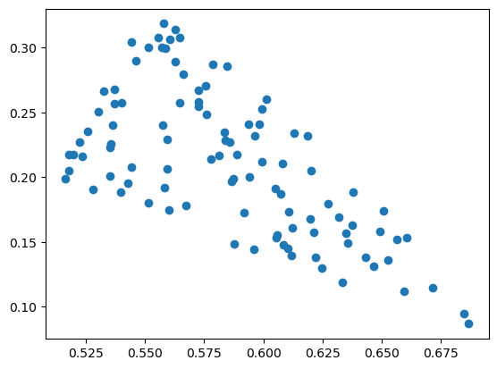

# geography

<!-- WARNING: THIS FILE WAS AUTOGENERATED! DO NOT EDIT! -->

## Install

``` sh
pip install geography
```

## How to use

create a random geometric graph from samples in a convex polytope

``` python
import numpy as np
import matplotlib.pyplot as plt
from scipy.spatial import ConvexHull
```

``` python
rgg = RGG(100,0.1, shape=ConvexHull(np.random.default_rng().uniform(0,1,(3,2))))
plt.scatter(*rgg.V.points.T)
```

    <matplotlib.collections.PathCollection>



``` python
plt.bar(*rgg.degree_distribution().T)
```

    <BarContainer object of 27 artists>


